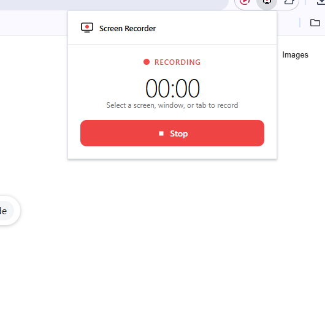

# Screen Recorder

A minimal Chrome extension to record your screen and download as MP4.



## Features

- Record screen, window, or tab
- Optional microphone
- Downloads as MP4 to your computer
- Clean popup interface — no extra tabs

## Install

1. Run setup:

```bash
npm install
npm run build
```

2. Open `chrome://extensions`
3. Enable **Developer mode**
4. Click **Load unpacked** and select this folder

## Usage

1. Click the Screen Recorder icon in the toolbar
2. Click **Start Recording** and choose what to share
3. Click **Stop** when finished
4. Your MP4 saves to Downloads automatically
